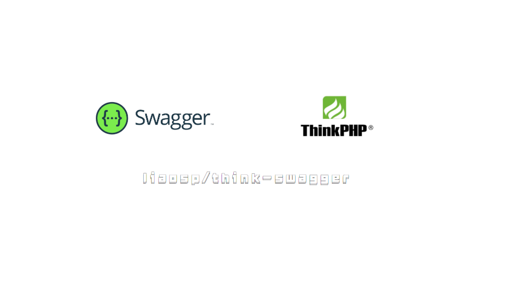
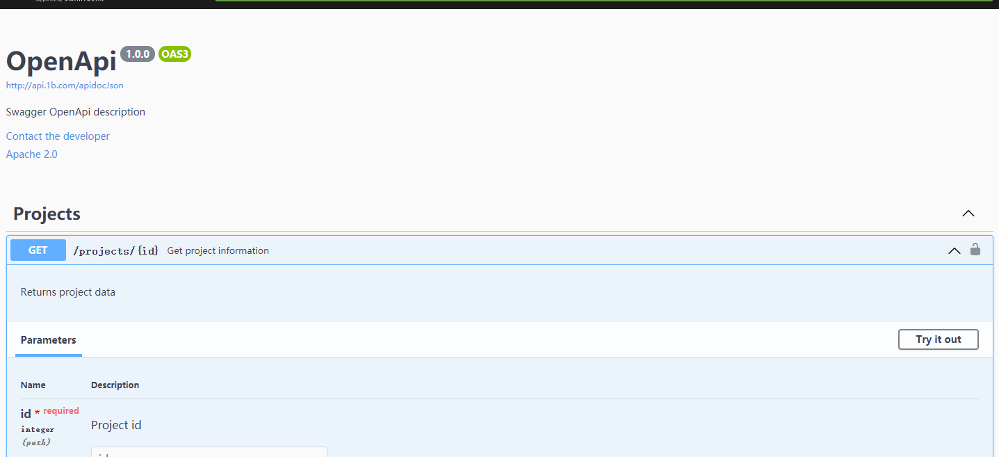

<h1 align="center"> think-swagger </h1>



<p align="center"> thinkphp5 自动生成swagger文档 swagger-ui  </p>


[](https://packagist.org/packages/liaosp/laravel-validate-ext)
[](https://packagist.org/packages/liaosp/laravel-validate-ext)
[](https://packagist.org/packages/liaosp/laravel-validate-ext)
[](https://packagist.org/packages/liaosp/laravel-validate-ext)
[](https://styleci.io/repos/53163405/)


<p color="red">TP6 后续发布</p>

## Installing

```shell
$ composer require liaosp/think-swagger -vvv
```

## Usage

安装好后，在application 下的任意文件写入：

```
     /**
      * @OA\Info(
      *      version="1.0.0",
      *      title="OpenApi",
      *      description="Swagger OpenApi description",
      *      @OA\Contact(
      *          email="darius@matulionis.lt"
      *      ),
      *     @OA\License(
      *         name="Apache 2.0",
      *         url="http://www.apache.org/licenses/LICENSE-2.0.html"
      *     )
      * )
      */
 
     /**
      * @OA\Get(
      *      path="/projects/{id}",
      *      operationId="getProjectById",
      *      tags={"Projects"},
      *      summary="Get project information",
      *      description="Returns project data",
      *      @OA\Parameter(
      *          name="id",
      *          description="Project id",
      *          required=true,
      *          in="path",
      *          @OA\Schema(
      *              type="integer"
      *          )
      *      ),
      *      @OA\Response(
      *          response=200,
      *          description="successful operation"
      *       ),
      *      @OA\Response(response=400, description="Bad request"),
      *      @OA\Response(response=404, description="Resource Not Found"),
      *      security={
      *         {
      *             "oauth2_security_example": {"write:projects", "read:projects"}
      *         }
      *     },
      * )
      */

```

访问：

>你的域名/apidoc




如果你想扫描指定的文件目录，在config/app.php 添加绝对路径

```
'swagger_path' =>'绝对路径 __DIR__ 自定义'
```


更多用法可参考我之前写的博客相关
 
[swagger 使用](https://liaosp.blog.csdn.net/article/details/119887281)

[如何写composer包](https://blog.csdn.net/qq_22823581/article/details/120035631)

## Contributing

You can contribute in one of three ways:

1. File bug reports using the [issue tracker](https://github.com/liaosp/think-swagger/issues).
2. Answer questions or fix bugs on the [issue tracker](https://github.com/liaosp/think-swagger/issues).
3. Contribute new features or update the wiki.

_The code contribution process is not very formal. You just need to make sure that you follow the PSR-0, PSR-1, and PSR-2 coding guidelines. Any new code contributions must be accompanied by unit tests where applicable._

## License

MIT
